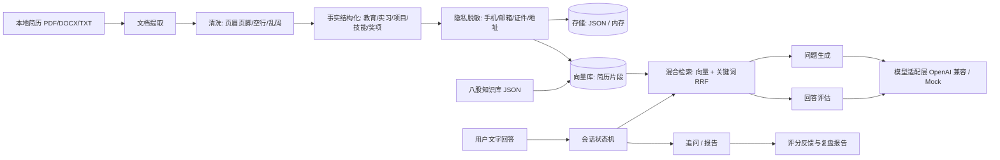

# 简历驱动的 AI 面试陪练系统（interview-agent）

导入自己的简历 → 系统结构化出项目/技能/经历事实 → 基于事实检索出题 → 文字作答 → 四维评分与纠错 → 追问 → 完整模拟面试 → 复盘报告。

这个项目的重点不是「调用一次大模型」，而是把**简历事实、检索、问题生成、面试状态、回答评估、学习报告**组织成一条可重复使用、可测试、可解释的流程。

> 当前状态：**MVP 全部功能已完成，自动化测试全绿（127 项，含真实 HTTP 端到端、MVP 总验收与打包后进程级冒烟）**。
> 文中所有量化结论都标注了来源（测试用例或脚本）；未实测的指标一律写「待测」，不做没有证据的宣称。

---

## 一、快速开始

### 1. 直接运行（推荐）

```bat
:: 1) 构建分发包（离线，无需联网）
powershell -ExecutionPolicy Bypass -File scripts\build-dist.ps1

:: 2) 启动服务（默认 http://127.0.0.1:8090）
dist\app.cmd

:: 3) 浏览器打开
start http://127.0.0.1:8090/index.html
```

`dist\app.cmd` 会自动设置 `app.home`，数据落在 `dist/data/*.json`，重启后可恢复历史会话与报告。

### 2. 接本地模型（可选，但推荐）

系统默认连接 **OpenAI 兼容协议**的本地模型服务，不需要云 API：

```bat
:: LM Studio：加载模型后在 Developer 页启动服务（默认 127.0.0.1:1234）
dist\app.cmd

:: 或者 Ollama（默认 127.0.0.1:11434/v1）
set INTERVIEW_LLM_BASE_URL=http://127.0.0.1:11434/v1
set INTERVIEW_LLM_CHAT_MODEL=qwen3:8b
dist\app.cmd
```

**模型没启动也能用**：系统会明确提示「模型未连接」，并自动降级为「模板出题 + 启发式评分」，结果会被标注为降级，不会假装成功（见下文「降级策略」）。

### 3. 离线 Mock 模式（无模型、无网络，用于演示与自动化测试）

```bat
dist\app.cmd --app.llm.provider=mock
```

### 4. 从源码开发

```bat
scripts\mvn.cmd clean test-compile          :: 编译（离线，项目本地仓库 .m2repo）
powershell -File scripts\run-tests.ps1      :: 编译 + 运行全部自动化测试
scripts\smoke-test.cmd                      :: 对已运行实例做 HTTP 冒烟验收
powershell -File scripts\build-dist.ps1     :: 组装 dist/
```

> 本机没有外网，Maven 依赖已镜像到 `.m2repo/`，构建脚本全部使用 `mvn -o`（离线）。
> 有网环境可以去掉 `-s .m2settings.xml -o`，走标准 `~/.m2` 仓库。
>
> 换机器时如果 `.m2repo/` 不在（已 gitignore，约 408MB），两种办法：
> 1) 有外网：直接用 `mvn clean test`（去掉离线参数），依赖会被自动下载；
> 2) 无外网：从已有缓存复制一份 `robocopy %USERPROFILE%\.m2\repository .m2repo /E`。

---

## 二、功能范围与验收标准

| 方案书 MVP 要求 | 实现情况 | 证据 |
|---|---|---|
| 支持一种简历文件格式 + 一种纯文本兜底 | PDF / DOCX / TXT 三种 + 粘贴文本 | `DocumentExtractorRouterTest`（13 项）、`POST /api/resumes/text` |
| 展示解析结果并允许人工修正 | 项目/技术栈/事实全部可编辑，保存后重建检索索引 | `PUT /api/resumes/{id}/facts`、`HttpEndToEndTest#resumeFactsEditableOverHttp` |
| 支持项目面与八股面 | `PROJECT` / `KNOWLEDGE` / `FULL` 三种模式 | `InterviewFlowTest#projectModeFullLoop`、`#knowledgeModeWithoutResume` |
| 问题生成、文字回答、评分、纠错 | 出题带来源引用；四维评分含依据/遗漏/纠错/建议 | `AnswerEvaluator`、`Prompts#EVALUATION_SYSTEM` |
| 至少一次追问或换题 | 追问（每题可配置上限）+ 换题（下一题） | `InterviewService#followUp`、`FollowUpLimitEnforced` 测试 |
| 结束面试并生成文字复盘 | Markdown + JSON 报告，含雷达/最弱题/缺口/风险/行动项 | `ReportBuilder`、`GET /api/interviews/{id}/report.md` |
| 处理空回答、模型超时、非法 JSON、检索为空 | 全部有明确错误码或降级路径，不出现 500 | `ApiExceptionHandler`、`StructuredOutputParserTest`、`retry/degrade` 测试 |

**明确不做（第一版边界）**：语音识别/合成、视频与表情分析、OCR 图片简历、账号权限与多租户、排行榜与社交功能。

---

## 三、架构



代码分层（`src/main/java/com/dusk4d/interview/`）：

| 包 | 职责 | 代表类 |
|---|---|---|
| `api` | REST 接口、DTO、统一异常处理 | `InterviewController`、`ApiExceptionHandler` |
| `service` | 业务编排、状态变更、字段校验 | `ResumeImportService`、`InterviewService` |
| `agent` | 提示词、出题、评分、追问、报告、状态机 | `QuestionGenerator`、`AnswerEvaluator`、`ReportBuilder`、`InterviewStateMachine` |
| `rag` | 向量库、混合检索、知识库 | `InMemoryVectorStore`、`DocumentRetriever`、`KnowledgeBase` |
| `llm` | 模型与向量化适配、可降级 | `OpenAiCompatibleClient`、`MockLlmClient`、`FallbackEmbeddingClient` |
| `parse` | 文档提取、清洗、事实抽取 | `PdfTextExtractor`、`DocxTextExtractor`、`ResumeFactExtractor` |
| `privacy` | 统一脱敏口径 | `PrivacyMasker` |
| `storage` | 仓储抽象与实现 | `InterviewRepository`、`JsonFileStore` |
| `domain` | 领域模型（record，不可变） | `Resume`、`InterviewSession`、`AnswerEvaluation` |
| `error` | 稳定错误码与 HTTP 语义 | `ApiException`、`LlmException` |

---

## 四、关键设计决策（含取舍）

### 1. Agent 形态：有限状态机 + 有限工具，而不是让模型自由决策

```text
CREATED -> RESUME_READY -> INTERVIEW_STARTED -> WAITING_ANSWER
WAITING_ANSWER -> EVALUATING -> FOLLOW_UP | NEXT_QUESTION
NEXT_QUESTION -> WAITING_ANSWER
EVALUATING -> FINISHED -> REPORT_READY
任意状态 -> FAILED | CANCELLED
```

* **状态只能由后端推进**，模型只输出结构化结果，不持有流程控制权 → 可测试、可恢复、不会「聊飞」。
* 非法转移抛 `409 INVALID_SESSION_STATE` 并给出可操作提示（`InterviewStateMachine`，7 项测试覆盖全部终态）。
* 每个动作有次数上限：题目上限、每题追问上限、回答长度上限（`app.interview.*`）。

**取舍**：放弃了「模型自主规划」的灵活性，换来确定性与可解释性。这也是方案书要求的边界。

### 2. 检索：向量 + 关键词混合，且「检索为空就是空」

* 向量层可选 `local`（进程内确定性哈希向量，离线可用、结果可复现）或 `remote`（LM Studio + nomic-embed-text），远端失败自动降级（`FallbackEmbeddingClient`）。
* 单靠向量容易漏掉「Redis 分布式锁」这类精确术语，因此**并行走一路关键词召回**，用 RRF 融合（`DocumentRetriever`）。
* 低于 `minScore` 直接过滤；**空召回不硬凑**，出题会回退到「简历事实原文」并在提示中标注来源，绝不编造。
* 每个片段带元数据：简历 ID、区块类型、项目名、来源顺序 → 前端可展示「这条依据来自哪段简历」，可用 `GET /api/retrieval/search` 复核。

### 3. 评分：Rubric + 结构化输出，四维等权

| 维度 | 检查内容 |
|---|---|
| 技术正确性 | 概念、机制、因果关系是否正确 |
| 内容完整性 | 是否覆盖问题的关键点 |
| 经历匹配度 | 是否与简历事实、个人职责一致（团队成果不自动算个人成果） |
| 表达结构 | 是否按背景 → 职责 → 机制 → 结果组织 |

输出包含：总分、四维分数与**打分依据**、可保留内容、遗漏点、错误点、建议补充、参考回答结构、证据告警、是否建议追问。
提示词硬约束：**没有证据的指标不得补写**，`evidenceWarnings` 专门收集「无证据的强主张」。

### 4. 降级策略（模型不可用也要给出明确结果）

| 失败类型 | 处理 | 用户看到 |
|---|---|---|
| 连接失败（模型未启动） | 出题→模板出题；评分→启发式评分 | 「模型服务未连接，已使用模板出题」 |
| 读超时 | 同上，不重试 | 「模型响应超时，已使用模板出题」 |
| 非法 JSON / 缺字段 | 解析器四步修复；仍失败则降级 | 「模型输出格式不符合要求，已降级」 |
| 空回答 | **不调用模型**，直接给 0 分与改进提示 | 「没有收到有效回答」 |
| 检索为空 | 回退到简历事实原文作为上下文 | 前端展示来源引用 |

启发式评分刻意把上限压到 3.5 并标记 `degraded`，避免「没有语义理解却给出高分」。

### 5. 隐私

* 解析后立即脱敏：手机号、邮箱、身份证、链接、地址 → 占位符；**联系方式不进入出题与评分上下文**。
* 入库与落盘的是脱敏文本；日志只记录 id、数量、耗时与置信度，**不记录简历原文**（可用 `PrivacyMasker#scan` 自检）。
* 默认使用本地模型，简历不需要离开本机。

### 6. 为什么没有用 Spring AI / POI / Spark 等依赖

离线环境决定了依赖必须「本地可解析」。因此做了两个刻意的替代：

* **DOCX 解析**：把 docx 当 zip 读取 `word/document.xml`，单次扫描提取段落/表格/换行语义（`DocxTextExtractor`），避免引入 Apache POI 及其 XMLBeans。
* **模型调用**：直接用 JDK `HttpClient` 实现 OpenAI 兼容协议（`OpenAiCompatibleClient`），把协议细节收敛在一个文件内，同时天然支持 LM Studio / Ollama / 云端兼容服务。

---

## 五、API

| 方法 | 路径 | 作用 |
|---|---|---|
| GET | `/api/health` | 服务/模型/向量化/知识库状态 |
| POST | `/api/resumes/import` | multipart 上传并解析简历（PDF/DOCX/TXT） |
| POST | `/api/resumes/text` | 粘贴文本导入 |
| GET | `/api/resumes`、`/api/resumes/{id}` | 列表 / 详情（脱敏文本 + 结构化事实） |
| PUT | `/api/resumes/{id}/facts` | 人工修正事实并重建索引 |
| DELETE | `/api/resumes/{id}` | 删除简历与其检索片段 |
| POST | `/api/interviews` | 创建会话 `{resumeId, mode, maxQuestions}` |
| GET | `/api/interviews`、`/api/interviews/{id}` | 会话列表 / 状态 |
| POST | `/api/interviews/{id}/next-question` | 获取下一题（含来源引用） |
| POST | `/api/interviews/{id}/answers` | 提交回答并返回评分 |
| GET | `/api/interviews/{id}/evaluation` | 查询最近一次反馈 |
| POST | `/api/interviews/{id}/follow-up` | 请求追问 |
| POST | `/api/interviews/{id}/finish` | 结束面试 |
| POST | `/api/interviews/{id}/report` | 生成/重新生成报告 |
| GET | `/api/interviews/{id}/report`、`/report.md` | 查看 / 下载报告 |
| GET | `/api/knowledge/topics`、`/api/knowledge/items` | 知识库主题与条目 |
| GET | `/api/retrieval/search` | 检索调试（验证「问题是否有依据」） |

错误响应统一为 `{code, message, path, timestamp, details}`，错误码稳定可断言：
`VALIDATION_ERROR(400)`、`NOT_FOUND(404)`、`INVALID_SESSION_STATE(409)`、`UNSUPPORTED_FILE / EMPTY_RESUME_TEXT(422)`、
`LLM_UNAVAILABLE(503)`、`LLM_TIMEOUT(504)`、`LLM_BAD_RESPONSE / LLM_INVALID_STRUCTURE(502)`、`INTERNAL_ERROR(500)`。

---

## 六、测试与验证

### 自动化测试（127 项，全部通过）

```bat
powershell -File scripts\run-tests.ps1
```

| 测试类 | 数量 | 覆盖内容 |
|---|---|---|
| `PrivacyMaskerTest` | 12 | 手机/邮箱/证件/地址脱敏、技术数字不误伤、日志脱敏 |
| `TextCleanerTest` | 9 | 空文本、归一化、页眉页脚、页码、乱码、噪声判定 |
| `DocumentExtractorRouterTest` | 13 | TXT(UTF-8/GBK)、DOCX(段落/表格/空正文)、PDF(文字/多页/图片型)、伪装扩展名 |
| `ResumeFactExtractorTest` | 10 | 区块识别、项目分块、技术栈、低置信度不编造、脱敏 |
| `VectorStoreTest` | 9 | 向量确定性、元数据过滤、minScore、幂等 upsert |
| `StructuredOutputParserTest` | 11 | 代码围栏、前后文截取、中文引号、截断修复、缺字段报错 |
| `InterviewStateMachineTest` | 7 | 全流程转移、终态封闭、非法转移拒绝、提示文案 |
| `HeuristicEvaluatorTest` | 7 | 空/答非所问/详细回答的排序、降级上限、报告统计 |
| `InterviewFlowTest` | 10 | 服务层端到端闭环 + 重复提交/空回答/越界/追问上限/人工修正 |
| `HttpEndToEndTest` | 9 | **真实 HTTP + 内嵌 Tomcat**：multipart 上传、静态资源、全链路、错误码、检索调试、题目上限自动结束 |
| `JsonFileStoreTest` | 4 | 写盘后重新打开仓储（模拟重启）读回简历/会话/评分/报告；损坏文件隔离 |
| `VectorIndexInitializerTest` | 4 | 启动期索引重建、幂等、空库跳过、空事实跳过 |
| `MultiResumeRegressionTest` | 4 | 4 份不同结构简历批量解析不丢字段、结果可复现、极简简历不编造 |
| `MvpAcceptanceTest` | 14 | **方案书第九节验收标准逐条对应**：全格式导入、事实修正、双模式出题、评分可解释、追问不串题、报告生成、四类失败路径、隐私、跨重启恢复，以及全部反面场景 |

合计 **127 项**。其中 `MvpAcceptanceTest` 是「一套跑完即可判断系统是否达标」的门禁测试。

### 进程级冒烟验收（打包后真实运行）

```bat
powershell -File scripts\build-dist.ps1
dist\app.cmd
scripts\smoke-test.cmd
```

冒烟脚本对运行中的实例断言：健康状态、前端可访问、简历导入与脱敏、检索来源引用、出题有据、四维评分、追问、题目配额、结束、报告与 Markdown 下载、错误码（400/404/409，无 500）。

### 当前可复现的实测数据（非宣称指标）

| 项目 | 数值 | 来源 |
|---|---|---|
| 自动化测试用例 | 127 项，失败 0 | `scripts\run-tests.ps1` |
| 打包体积 | `dist/` ≈ 23.9 MB（43 个依赖 jar） | `scripts\build-dist.ps1` |
| 应用启动耗时 | ≈ 3.0 秒（空库，Mock 模型） | `dist/run-out.log` |
| 知识库种子 | 31 条，8 个主题 | `GET /api/health` |
| 单份简历解析后事实数 | 6 条（示例简历），项目 1 个，技术栈 14 项 | 冒烟脚本输出 |

### 尚未测量的指标（**不在简历里写成结论**）

问题相关性比例、评分一致性（同答案多次运行的分数方差）、结构化输出成功率、平均响应时间、
完整面试完成率、用户满意度。这些需要按方案书第十一节建立评测集（10 份简历 + 人工标注问题/回答）后测量，当前**待测**。
系统已预留观测点：`/api/retrieval/search` 用于复核问题依据，评分结果里的 `degraded` 标记用于统计降级率。

---

## 七、配置项

| 配置 | 默认值 | 说明 |
|---|---|---|
| `app.llm.base-url` | `http://127.0.0.1:1234/v1` | OpenAI 兼容服务地址（LM Studio / Ollama） |
| `app.llm.chat-model` | `qwen2.5-7b-instruct` | 模型名 |
| `app.llm.embedding-model` | `text-embedding-nomic-embed-text-v1.5` | 远程向量模型（`app.embedding.mode=remote` 时使用） |
| `app.llm.read-timeout-ms` | 45000 | 读取超时，超时走降级而非 500 |
| `app.embedding.mode` | `local` | `local` 哈希向量 / `remote` 远端向量 |
| `app.retrieval.top-k` / `min-score` | 5 / 0.08 | 检索条数与最低相似度 |
| `app.interview.max-questions` | 8 | 单场题目上限 |
| `app.interview.follow-up-limit-per-question` | 1 | 每题追问上限 |
| `app.storage.mode` | `file` | `file`（`<app.home>/data/*.json`）/ `memory` |
| `app.privacy.mask-pii` / `mask-name` | true / false | 脱敏开关 |
| `INTERVIEW_KNOWLEDGE_PATH` | - | 外部知识库 JSON（同 ID 覆盖、新 ID 追加） |
| `app.llm.provider` | `local` | 设为 `mock` 使用离线确定性 Mock |

---

## 八、部署（Docker）

```bat
cd deploy
docker compose up -d --build
:: Ollama 一起启动（可选，profile: ollama）
docker compose --profile ollama up -d --build
```

应用镜像基于 `eclipse-temurin:21-jre`，挂载 `./data` 持久化，`/api/health` 作为健康检查。
详见 `deploy/README.md`。

---

## 九、发布到 GitHub（需联网环境执行）

开发机没有外网，因此仓库已在本地准备好（3 个提交在 `main` 分支），但未能推送。到有网络的环境执行：

```bat
:: 方式一：已登录 GitHub CLI（推荐）
gh auth login
scripts\publish-github.cmd

:: 方式二：手工推送
git remote add origin https://github.com/Dusk4d/interview-agent.git
git push -u origin main
```

> 仓库体积约 22MB（不含 `.m2repo/` 离线依赖镜像，已被 `.gitignore` 排除）。
> 首次推送前建议确认 `git status` 干净，且不要提交 `dist/`、`data/`、`target/`。

## 十、面试汇报要点与代码证据

| 面试常问 | 一句话回答 | 代码证据 |
|---|---|---|
| 为什么叫 Agent，而不是 RAG？ | 有显式会话状态机 + 条件路由（追问/换题/结束）+ 有限工具与次数上限 | `agent/InterviewStateMachine.java`、`service/InterviewService.java` |
| 如何避免问题脱离简历？ | 出题上下文只来自检索到的简历片段/知识点，并对模型自造 sourceIds 做白名单过滤 | `agent/QuestionGenerator#toPlan`、`rag/DocumentRetriever.java` |
| 评分为什么可信？ | 固定 Rubric + 结构化输出 + 分项依据 + 降级时压低上限并标注 | `agent/AnswerEvaluator.java`、`agent/HeuristicEvaluator.java` |
| 模型挂了怎么办？ | 连接/超时/非法 JSON/空回答四类分别有明确降级路径，不抛 500 | `error/LlmException.java`、`api/ApiExceptionHandler.java` |
| 简历隐私怎么处理？ | 脱敏在解析后立即执行，联系方式不进上下文，日志不写原文 | `privacy/PrivacyMasker.java`、`HttpEndToEndTest#uploadResumeViaMultipart` |
| 怎么验证质量？ | 127 项自动化测试 + 打包后进程级冒烟；评测集与量化待补 | `src/test/java/**`、`scripts/smoke-test.cmd` |

更多设计与取舍见 `docs/DESIGN.md`，接口细节见 `docs/API.md`，验证步骤见 `docs/VERIFICATION.md`。

---

## 十一、目录结构

```text
interview-agent/
├── pom.xml                     Maven 构建（离线可用）
├── README.md                   本文
├── docs/                       设计、接口、验证、面试讲解文档
├── deploy/                     Dockerfile + docker-compose + 部署说明
├── scripts/                    构建/测试/打包/冒烟/发布脚本（离线）
│   ├── mvn.cmd                 离线 Maven 包装（-o + 项目本地仓库）
│   ├── resolve-classpath.ps1   离线类路径解析（含版本锁定）
│   ├── run-tests.ps1           编译 + 运行全部测试
│   ├── build-dist.ps1          组装 dist/（app.jar + lib/ + 启动脚本）
│   ├── smoke-test.cmd/.ps1     对运行中实例做 HTTP 冒烟验收
│   └── publish-github.cmd      推送到 GitHub（需联网）
├── src/main/java/...           后端源码（见上文分层）
├── src/main/resources/
│   ├── application.properties  配置
│   ├── knowledge/knowledge-base.json  八股知识库种子（31 条）
│   └── static/                 前端（index.html / styles.css / app.js，零依赖）
└── src/test/java/...           127 项自动化测试 + 测试工具
```

---

## 十二、已知限制与下一步

* **无语音**：文本陪练，不含语音识别/合成与视频分析。
* **无 OCR**：图片型/扫描版 PDF 会明确提示不支持，而不是产出虚假结构。
* **向量能力**：默认哈希向量在离线环境可用但不是语义模型；接 `app.embedding.mode=remote` 效果更好，混合检索用于弥补字面召回。
* **未测指标**：评分一致性、问题相关性等需要按方案书建立评测集后测量（见第六节）。
* **下一步**：评测集与量化报告 → 多轮对话式追问策略 → 历史报告趋势 → 语音链路。

> 免责声明：本系统的评分仅作为训练辅助，不作为客观考试成绩。
