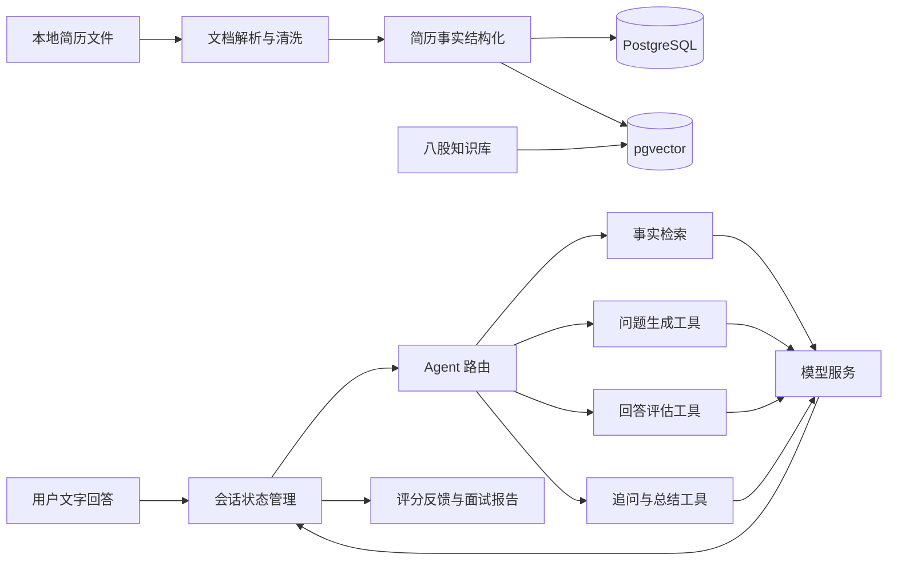

# AI 面试陪练系统项目方案

## 一 项目定位

这是一个面向求职者的简历驱动型 AI 面试陪练系统。用户导入自己的简历后，系统先提取教育经历、实习经历、项目、技术栈和奖项等内容，再根据用户选择的面试模式生成问题。用户以文字回答，系统对回答进行评分、指出缺失和错误，并给出更完整的表达建议。完成单题练习后，用户还可以进入一场完整的文本模拟面试，经历开场、项目追问、基础知识题、阶段切换和最终复盘。

项目的核心不是“调用一次大模型”，而是把个人简历事实、检索、问题生成、面试状态、回答评估和学习报告组织成一条可重复使用的流程。对于 Java 后端和 AI 应用岗位，这个项目可以同时展示后端接口、数据建模、RAG、Agent 工作流和结构化输出能力。

当前状态：产品雏形，尚未完成开发和验证。以下内容是推荐的实现方案，不应直接写成已完成的简历经历。

## 二 项目目标与边界

### 2.1 目标

1. 让问题与用户自己的简历相关，而不是只返回通用题库。
2. 让项目面、八股面和完整模拟面试有不同的流程和评分重点。
3. 让每次回答得到可解释的反馈，用户能知道错在哪里、缺什么以及如何重答。
4. 让一次面试可以连续进行，系统能记录当前题目、回答、追问和阶段。
5. 让面试结果沉淀为可复习的报告，包括薄弱知识点和项目追问风险。

### 2.2 第一版不做什么

- 不做语音识别、语音合成和视频表情分析，第一版只做文本交互。
- 不承诺替代真人面试，评分只作为训练辅助，不作为客观考试成绩。
- 不先做复杂社交功能、排行榜和多人协作，把重点放在个人训练闭环。
- 不把所有 Agent 能力都放进第一版，先完成有限状态、有限工具和可解释反馈。

## 三 用户使用流程

### 场景一 单题项目练习

用户上传简历，选择“项目面”，选择某个项目或让系统自动选择。系统读取项目背景、技术栈、个人职责和已知难点，生成一道主问题。用户回答后，系统返回总分、分项评价、遗漏点、技术纠正和参考回答。用户可以选择“继续追问”“重新回答”或“换一道题”。

### 场景二 八股专项练习

用户选择 Java、Spring、MySQL、Redis、计算机网络等主题，并设置难度。系统从知识库召回相关知识点生成问题，回答后按照概念准确性、原理完整性、边界条件和表达结构进行评价。这里不应把用户没有做过的技术项目伪装成其个人经历。

### 场景三 完整文本模拟面试

系统按预设流程推进：自我介绍、项目经历、项目深挖、基础知识、反问准备和总结。每一轮结束时保留阶段摘要和风险点，下一轮只携带必要上下文。用户中途可以暂停或结束，系统生成本场报告。

## 四 推荐技术方案

为了和现有 Java 后端经历衔接，推荐采用 Java 主线：

| 层次 | 推荐方案 | 作用 |
|---|---|---|
| 前端 | Vue 3、TypeScript、Element Plus | 文件上传、面试对话、评分卡片和报告展示 |
| 后端 | Java 21、Spring Boot、Spring MVC | 用户、简历、面试会话和模型服务接口 |
| AI 编排 | Spring AI | ChatClient、结构化输出、Embedding 和工具调用 |
| 模型 | LM Studio 或 Ollama 提供本地模型 | 本地开发和隐私友好的模型调用 |
| 文档解析 | Apache Tika、PDFBox、Apache POI | PDF、DOCX 和纯文本读取 |
| 关系数据库 | PostgreSQL | 用户、简历、会话、问题和评分结果 |
| 向量检索 | pgvector | 简历片段和知识点的相似度检索 |
| 缓存 | Redis | 短期会话、重复查询和限流辅助 |
| 工程工具 | Maven、Git、Docker、Postman | 构建、版本管理、环境和接口验证 |

如果实际选择 Python/FastAPI 或其他技术栈，应以真实实现为准，不需要为了迎合简历强行使用 Java。重要的是系统边界和个人贡献能被代码证明。

## 五 系统架构



推荐把 Agent 限制在明确的工作流内，而不是让模型自由调用所有服务。后端负责权限、状态、次数、超时和数据校验；模型负责语言理解、问题生成和反馈草稿；程序负责最终状态变更和结构化结果校验。

## 六 核心模块设计

### 6.1 简历导入与解析模块

输入：PDF、DOCX 或 TXT 文件。

处理步骤：

1. 校验扩展名、大小和文件是否可读。
2. 提取正文文本，清除页眉页脚、重复空行和无意义符号。
3. 按标题、时间和项目名称识别教育、实习、项目、技能和奖项区块。
4. 将内容保存为结构化事实，并保留原始片段作为引用来源。
5. 将可检索片段写入向量库，元数据至少包括简历 ID、区块类型、项目名称和来源顺序。

解析失败时必须返回明确原因。对于图片型 PDF，第一版可以提示“暂不支持图片简历”，不要默默生成虚假的结构化内容。手机号和邮箱只用于个人页面展示，不应进入问题生成上下文。

### 6.2 知识库模块

知识库分为两类：

- 个人事实库：来自简历的项目背景、个人职责、技术栈、时间和奖项。
- 基础知识库：Java、Spring、MySQL、Redis、网络等八股知识和参考要点。

两类内容必须用元数据区分。项目面检索个人事实，八股面检索基础知识，混合面试可以同时检索但必须在提示中标明来源。每个片段应保留来源，反馈时能够指出“这条建议来自哪段简历或哪条知识点”。

### 6.3 Agent 路由与状态机

建议定义有限状态，而不是让模型自行维护流程：

```text
CREATED -> RESUME_READY -> INTERVIEW_STARTED -> WAITING_ANSWER
WAITING_ANSWER -> EVALUATING -> FOLLOW_UP 或 NEXT_QUESTION
NEXT_QUESTION -> WAITING_ANSWER
EVALUATING -> FINISHED -> REPORT_READY
任意状态 -> FAILED 或 CANCELLED
```

会话对象至少需要保存：当前模式、当前阶段、当前项目、当前问题、回答次数、已覆盖主题、最近反馈摘要、剩余题数和结束原因。

Agent 可以通过以下工具完成动作：

1. `retrieve_resume_facts`：按项目、技术或职责检索个人事实。
2. `retrieve_knowledge`：按八股主题检索知识点和参考要点。
3. `generate_question`：根据模式、难度和上下文生成主问题。
4. `evaluate_answer`：按评分标准分析用户回答。
5. `generate_follow_up`：根据遗漏点生成一次追问。
6. `build_report`：汇总会话记录和薄弱点。

工具调用必须有参数校验和调用次数上限。模型不能直接修改会话状态，所有状态变更由后端根据结构化结果执行。

### 6.4 问题生成模块

问题对象建议包含：

```json
{
  "type": "PROJECT",
  "difficulty": "MEDIUM",
  "question": "为什么在该项目中使用 Redis 分布式锁？",
  "focus": ["设计动机", "并发边界"],
  "sourceIds": ["resume-project-001"],
  "followUpPlan": "如果用户只回答技术名词，继续追问锁粒度和释放机制"
}
```

项目面问题建议按“事实确认—技术机制—设计取舍—异常边界—验证结果”逐层深入。八股问题建议按“概念—原理—应用—边界—对比”逐层深入。生成后需要检查问题是否超出简历事实、是否与已问问题重复、是否包含无法回答的内部信息。

### 6.5 答案评估模块

推荐第一版使用四个维度，每项 0 到 5 分：

| 维度 | 检查内容 |
|---|---|
| 技术正确性 | 概念、机制和因果关系是否正确 |
| 内容完整性 | 是否回答了问题要求的关键点 |
| 经历匹配度 | 是否与简历事实和个人职责一致 |
| 表达结构 | 是否按背景、动作、机制和结果组织 |

评估输出不要只有总分，建议返回：总分、分项分数、回答中可保留的内容、遗漏点、错误点、建议补充的信息、参考回答结构和是否建议追问。评分提示中要明确：没有证据的指标不能被模型补写，团队成果不能自动变成个人成果。

### 6.6 面试报告模块

报告可以包含：

- 基本信息：面试模式、完成时间、题目数量和回答数量；
- 能力雷达：项目表达、Java 基础、数据库、中间件、AI 应用等维度；
- 典型问题：最需要重新回答的 3 到 5 个问题；
- 知识缺口：概念错误、边界遗漏和没有证据的强主张；
- 项目风险：面试官可能继续追问的技术点；
- 行动建议：下一次练习应先复习什么、重答什么。

第一版可以只生成 Markdown 或 JSON 报告，不必一开始就做复杂图表。

## 七 数据模型建议

| 表 | 关键字段 | 作用 |
|---|---|---|
| `resume` | id、file_name、raw_text、status、created_at | 保存一次简历导入 |
| `resume_fact` | id、resume_id、type、project_name、content、source_order | 保存结构化事实 |
| `knowledge_item` | id、topic、difficulty、content、reference_answer | 保存八股知识点 |
| `interview_session` | id、resume_id、mode、stage、status、started_at、ended_at | 保存一次面试 |
| `interview_question` | id、session_id、type、content、source_ids、sequence | 保存面试问题 |
| `interview_answer` | id、question_id、content、created_at | 保存用户回答 |
| `answer_evaluation` | answer_id、total_score、dimension_scores、missing_points、correction | 保存评分和纠错 |
| `interview_report` | session_id、summary、weak_topics、follow_up_risks | 保存最终复盘 |

如果第一版只是本地单用户 Demo，可以先使用 SQLite 或内存会话，后续再迁移 PostgreSQL。不要为了看起来复杂而提前实现账号、权限和多租户。

## 八 API 草案

| 方法 | 路径 | 作用 |
|---|---|---|
| POST | `/api/resumes/import` | 上传并解析简历 |
| GET | `/api/resumes/{id}` | 查看简历解析结果 |
| POST | `/api/interviews` | 创建面试会话 |
| POST | `/api/interviews/{id}/next-question` | 获取下一道问题 |
| POST | `/api/interviews/{id}/answers` | 提交文字回答 |
| GET | `/api/interviews/{id}/evaluation` | 查询当前回答反馈 |
| POST | `/api/interviews/{id}/follow-up` | 请求一次追问 |
| POST | `/api/interviews/{id}/finish` | 结束面试并生成报告 |
| GET | `/api/interviews/{id}/report` | 查看复盘报告 |

接口层负责参数校验、权限、幂等和错误码；服务层负责会话状态和业务规则；AI 适配层负责模型调用与结构化解析。模型超时、非法 JSON 和检索为空不能直接暴露成 500 堆栈。

## 九 MVP 范围与验收标准

### MVP 必做

1. 支持一种简历文件格式和一种纯文本兜底输入。
2. 能展示解析后的项目和技术栈，允许用户手动修正解析结果。
3. 支持项目面和八股面两种模式。
4. 支持问题生成、文字回答、评分和纠错。
5. 支持至少一次追问或换题。
6. 支持结束面试并生成文字复盘。
7. 能处理空回答、模型超时、非法结构化输出和检索为空。

### 不通过验收的情况

- 问题大量脱离简历内容；
- 评分没有理由或每次结果差异过大；
- 追问串错项目或把上一道题的上下文带到下一道题；
- 模型失败后页面一直等待，没有明确提示；
- 简历原文和隐私字段被无必要写入日志；
- 项目只能展示页面，无法完成一次可重复的端到端演示。

## 十 开发计划

### 阶段一 先做可运行闭环

完成文件导入、文本清洗、单题生成、文字回答和基础反馈。先不做复杂 Agent，把流程跑通并保存一次会话记录。

### 阶段二 加入 RAG 和事实边界

加入简历事实结构化、Embedding、向量检索和来源引用；验证生成的问题是否来自正确项目，避免模型编造用户经历。

### 阶段三 加入 Agent 状态和追问

引入有限状态机、工具调用、项目面/八股面路由、追问和换题。为每个状态写正常、空输入、超时和失败测试。

### 阶段四 加入评分 Rubric 和报告

固定评分维度和 JSON Schema，生成分项反馈、可复述答案和整体报告。用人工准备的回答样例测试评分一致性。

### 阶段五 完善工程质量

补充数据库持久化、日志脱敏、接口文档、异常处理、Docker 部署和演示材料。只有这个阶段完成后，才适合把项目写进简历。

## 十一 测试与量化方案

没有实际测量前，不要填写数字。建议建立以下测试集：

- 10 份不同结构的简历，检查解析字段是否丢失；
- 每份简历准备若干人工认可的问题，检查生成问题的相关性；
- 准备高质量、部分正确、完全错误和答非所问的回答，检查评分排序；
- 重复运行同一回答，记录分数和反馈差异；
- 模拟空回答、接口超时、非法 JSON、向量库无结果和用户主动结束；
- 检查请求日志、数据库和错误页面中是否泄露手机号、邮箱和完整简历。

可在项目完成后再决定是否记录：解析成功率、问题相关性、评分一致性、结构化输出成功率、平均响应时间和完整面试完成率。每个指标必须写明样本范围、测量方法和时间。

## 十二 汇报讲解顺序

1. 先说痛点：通用题库和普通聊天无法结合个人简历形成连续训练。
2. 再说闭环：导入简历、检索事实、生成问题、回答评估、追问和报告。
3. 接着画架构：文档层、知识层、Agent 层、会话层和展示层。
4. 重点讲一个难点：如何避免问题脱离简历，以及如何让评分可解释。
5. 再讲工程边界：状态管理、模型失败、结构化输出和隐私处理。
6. 最后展示一次完整 Demo，并说明当前版本的不足和下一步计划。

## 十三 完成后的简历候选描述

在项目真正完成并有测试证据后，可以根据实际情况改成类似下面的表述：

> **简历驱动的 AI 面试陪练系统**：支持本地简历导入、项目面与计算机基础面问题生成、文字回答评估和完整模拟面试。基于简历事实检索组织问题上下文，通过有限状态工作流管理提问、回答、追问和总结，并按结构化评分标准输出分项反馈与复盘报告。

这段文字只能在对应功能已经完成、你能展示代码和演示、并且能说明个人负责边界后使用。若最终只完成 RAG 问答和固定流程，应把项目定位为“简历驱动的 RAG 面试练习系统”，不要直接写成完整 Agent。
